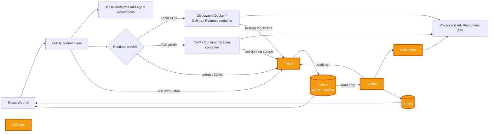
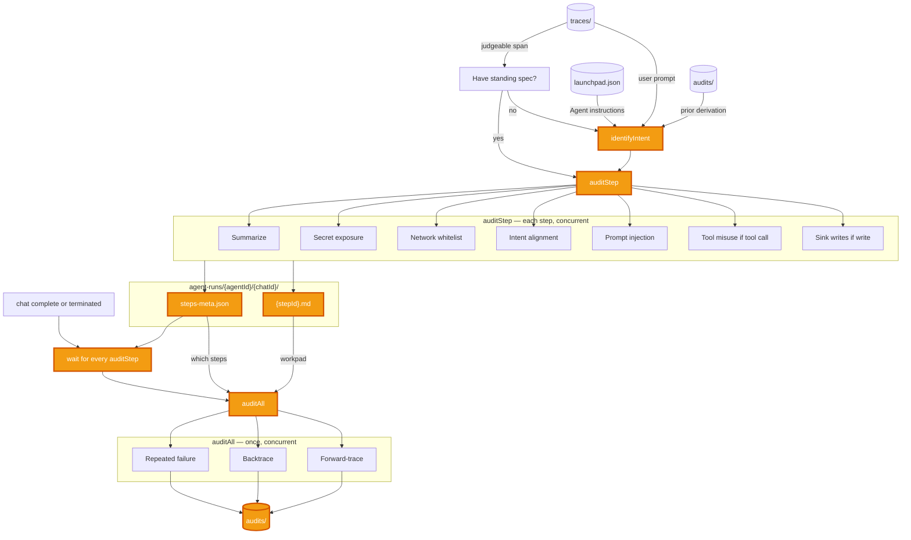
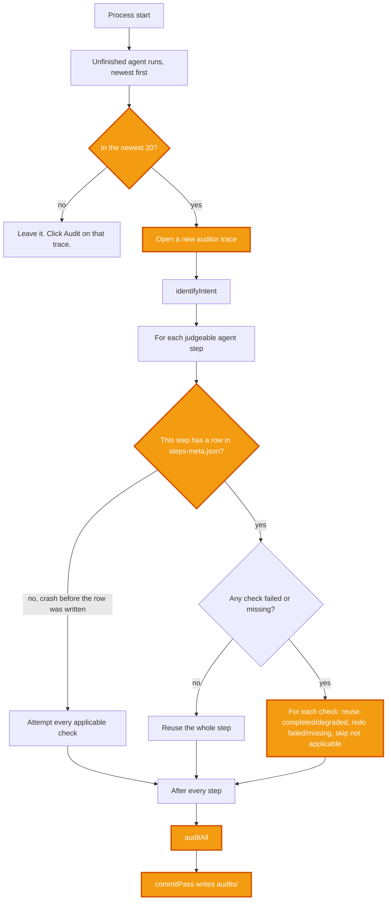

# Monkey Auditor, Agent Tracing and Auditing

## Problem
You cannot improve what you cannot trace.

We create agents to achieve some desired goal. As the agent progresses, we may introduce new constraints and guardrails. But how can we be sure these constraints and guardrails actually work? We have to trace through the agent execution (Tool calls, subagent spawns, input / output). This gets tedious. 

## Middleware Solution
We propose a middleware that traces through agent runs and audit it.

### Integration Points


### The Auditor



#### Artifacts
| Action | Remark |
| --- | --- |
| `identifyIntent` | Runs only when this chat has no standing spec yet. Agent instructions from `launchpad.json`, user prompt from `traces/`, prior derivation from `audits/`. Later spans skip it and go to `auditStep`. Intent alignment uses that spec. |
| `{stepId}.md` | Durable memory for the auditor. Each step audit writes its working state here so `auditAll` still has something to read after the step is gone. A workpad, not a report. |
| `steps-meta.json` | Index into that workpad. `auditAll` uses it to decide which `{stepId}.md` files to open, rather than rereading every step. |
| Wait until every `auditStep` has finished | `auditAll` needs the workpad complete. Starting against an in-flight step misses the instruction that just landed. |
| `audits/` | Where finished audit results are stored. The workpad is how the auditor thinks. This is what it concluded. |

#### Policies
| Type | Policy | Remark |
| --- | --- | --- |
| Security | Network Call Whitelist | Check whether a URL in the step is an actual network call (not just mentioned), then whether the host is on `AUDIT_NETWORK_WHITELIST`. Unset disables the check; empty denies every destination. |
| Security | Secret Leaking | Check against env values leaking or secrets matched by a regex secret pattern. Warn when a credential is exposed and does not belong in the operation. |
| Security | Prompt Injection | Check tool output, files, and subagent replies for planted instructions: leak secrets, hide them in HTML, phone home and obey the reply, or override prior instructions. Warn even if the agent ignored them. |
| Security | Tool Misuse | On tool calls, check arguments for flags that escape the sandbox or escalate privileges. |
| Security | Sink Writes | On file writes and tool output, classify what was written. Warn if credentials, env bindings, or other sensitive data land somewhere they do not belong, including HTML comments. |
| Security | Injection Follow-through | After the run, check whether a later step actually carried out a planted instruction from untrusted content. |
| Intent | Intent Alignment | Check whether the step's actions conflict with the user's standing objective and constraints. Raised as a suspicion; one step cannot settle it. |
| Intent | New Objectives | Check whether tool output, a file, or a subagent introduced a goal the user never asked for, and whether the agent acted on it. |
| Intent | Backtrace | For every intent suspicion, read the run history and decide whether anything the user asked for accounts for the action. |
| Reliability | Repeated Failure | Check whether the agent retried a tool call that had already failed. |

### Auditor Recovery

Suppose the auditor crashes mid audit (e.g. Shut off the poc mid audit).

Upon restart, the auditor resumes agent runs whose run level audit never finished. Completed checks are reused. It does not redo a run that already got an `auditAll`.

**NOTE:** This POC only auto-resumes the 20 newest unfinished runs. The rest stay `auditComplete: false` until a later boot or you open the trace and click Audit. 



Audit Step States

| Cached status | Meaning | On resume |
| --- | --- | --- |
| `completed` | Primary model returned a verdict | Reuse |
| `degraded` | Fallback still produced a verdict | Reuse |
| `failed` | No verdict | Re-ask |
| missing | No row, or that check never written | Re-ask |
| not applicable | Gated off | Skip |

## Setup

### Requirements
```
Node.js 22+
npm 10+
Docker, Colima, or Podman
A Volcengine Ark API key and endpoint that supports the Responses API
```
Codex CLI is included in the Runtime image and is not required on the host.

### Local browser SOP
Install Node.js 22+ and one supported container engine, then verify them:
```
node --version
npm --version
docker --version        # Docker Desktop, Docker Engine, or Colima
podman --version        # Use this instead when running Podman
```
Only one container engine is required. Codex CLI is already included in the Runtime image.

### 3. Start the POC

```bash
export ARK_API_KEY=your-ark-api-key 
export ARK_MODEL=ep-your-endpoint-id 
export ARK_BASE_URL=https://ark.ap-southeast.bytepluses.com/api/v3 
npm run poc
```

The first run installs Node.js dependencies and builds the Runtime image. The
script automatically selects Docker, Colima, or Podman.

The control plane listens on `PORT` (default `3000`). In development the UI is
Vite on `5173` and talks to that API. In production the same process serves the
built SPA at `/`.

### Testing
```bash
export ARK_API_KEY=your-ark-api-key 
export ARK_MODEL=ep-your-endpoint-id 
export ARK_BASE_URL=https://ark.ap-southeast.bytepluses.com/api/v3 
export RUN_LIVE_E2E=true
npm run check
npm run test:e2e
```

`RUN_LIVE_E2E=true` is required for `npm run test:e2e` to do anything — without it,
the Playwright suite has no `webServer` to run against and every spec skips itself.
The suite drives real Codex runs through a real container runtime, so it also needs
a container engine available (Docker, Colima, or Podman).

## HTTP API

When `APP_AUTH_TOKEN` is set, every `/api/` route except `/api/health` and
`/api/auth` requires `Authorization: Bearer <token>`. Errors return
`{ "error": "..." }`. Validation failures add `details`.

Trace data is never posted to the control plane — the server scrapes it
directly from each Runtime's own session log (Codex's rollout file under
`CODEX_HOME`, Claude Code's transcript under `CLAUDE_CONFIG_DIR`), so there is
no collector endpoint or token to configure.

### Health and system

| Method | Path | Returns |
| --- | --- | --- |
| `GET` | `/api/health` | `{ ok, service }`. Always open. |
| `GET` | `/api/auth` | `{ required }`. Whether the operator token is configured. Always open. |
| `GET` | `/api/system` | Runtime, model, sandbox, container engine, and whether Ark is configured. |

### Agents and runs

Agent and run ids are UUIDs. Create body: `{ name, description?, instructions? }`
(`name` 1 to 80 characters). Patch is the same fields, partial, at least one
required. Message body: `{ content }` (1 to 50,000 characters).

| Method | Path | Returns |
| --- | --- | --- |
| `GET` | `/api/agents` | `{ agents }`. |
| `POST` | `/api/agents` | `201 { agent }`. |
| `GET` | `/api/agents/:id` | `{ agent }`. |
| `PATCH` | `/api/agents/:id` | `{ agent }`. `409` if a run is in progress. |
| `DELETE` | `/api/agents/:id` | `{ archivedWorkspace }`. Forgets that agent's run-context chain. |
| `POST` | `/api/agents/:id/start` | `{ agent }` with status `ready`. |
| `POST` | `/api/agents/:id/stop` | `{ agent }`. Cancels an in-flight run. |
| `GET` | `/api/agents/:id/messages` | `{ messages }`. |
| `GET` | `/api/agents/:id/runs` | `{ runs }`. |
| `POST` | `/api/agents/:id/messages` | `202 { run, message }`. Starts a run. Poll `GET /api/runs/:id`. `409` if stopped or already busy. `503` if Ark is not configured. |
| `GET` | `/api/runs/:id` | `{ run }`. Status, output, `error`, and attributed `failure`. |

`failure` has `layer`, `kind`, `retryability`, `title`, `detail`, `remedy`, and
`exitCode`. Layer is `platform`, `provider`, `policy`, `agent`, `task`, or
`user`. Only `agent` and `task` mean the agent is what to change.

### Glass Box traces

These dump the stored record so the UI can render it. Auditor runs share the
agent's id but are omitted from the agent's run list. Open one via the run it
judged, then `auditTraceId`.

| Method | Path | Returns |
| --- | --- | --- |
| `GET` | `/api/agents/:id/traces` | `{ traces }` newest first. Prompt, status, usage, `failure`, `failingSpanId`, `errorCount`, `recoveredErrorCount`, `evidenceComplete`, `warningCount`, `suspicionCount`, `auditHealth`. |
| `GET` | `/api/agents/:id/failures` | `{ failures }` grouped by `kind`, agent-blame first, then by count. |
| `GET` | `/api/traces/:id` | Full `trace` (every span), `findings`, `intent`, `context` (carried in/out, thread position), `auditComplete`, `auditHealth`, `auditTraceId`, `auditChain`. `404` if missing. |
| `GET` | `/api/traces/:id/download` | Same payload plus `exportedAt`, as `trace-<id>.json`. |

`warningCount` is what the auditor concluded about the agent.
`suspicionCount` is what it could not settle. `auditHealth` is `ok`,
`degraded`, or `failed`, and is the auditor reporting on itself.
`evidenceComplete` is false when the output cap truncated the stream.

### Agent traces (`/ai`)

Same stores as Glass Box, compressed for a diagnosing agent. Typical loop:
list with `?blame=agent`, open the case file, fall back to
`GET /api/traces/:id` only if you need a span the case file clipped.

| Method | Path | Returns |
| --- | --- | --- |
| `GET` | `/api/agents/:id/traces/ai` | `{ traces }`. Prompt clipped to 240 characters. `diagnosis` has headline, layer, blame, kind, remedy, and where. No evidence blob. Query `blame` is `agent` or `environment`. Query `status` is `running`, `completed`, `failed`, or `cancelled`. |
| `GET` | `/api/agents/:id/failures/ai` | `{ failures }` grouped by `kind`, agent-blame first. Includes `blamesAgent`, a `detail` sample, and `traceIds`. Skips auditor traces. |
| `GET` | `/api/traces/:id/ai` | Case file. No `trace.spans`. Prompt clipped to 2,000 characters. |

The case file carries:

- `diagnosis`, including clipped evidence, `where`, and `causedBy`. Null on a clean run. A completed run that recovered from a classified failure still has one, with `outcome: "recovered"`.
- `intent` and `context.carriedIn` (summary only)
- `findings` with step labels, not bare span ids
- `trajectory`: one-liners for tool, model, and user steps (last 20). No run/turn wrappers. `trajectoryTruncated` is how many were dropped.
- `failingStep` / `causedByStep`: commands, files, clipped arguments and output
- `auditComplete`, `auditHealth`, `auditTraceId`, `auditChain`

### Audits and intent

Automatic audit fires for agent runs (audit depth 0) only. Deeper audits are
on demand, so a stack of auditors goes only as far as someone asked.

| Method | Path | Returns |
| --- | --- | --- |
| `GET` | `/api/audits/:id` | What the auditor did while judging this trace: `auditedTraceId`, `auditTraceId`, `auditor`, `health`. `:id` is the judged run, not the auditor's. `404` if missing. |
| `POST` | `/api/traces/:id/audit` | `{ traceId, auditTraceId }`. Re-audits this trace, at any depth. `409` if one is already running. `503` if auditing is disabled. |
| `GET` | `/api/audits/:id/archive` | Zip: `memory/{stepId}.md`, `memory/steps-meta.json`, `audit.json`. |
| `GET` | `/api/agents/:id/intent` | Standing spec: `{ intent, diverged, versions, intentId }`. `diverged` means the conversation's objective has not been adopted into the agent's instructions. |
