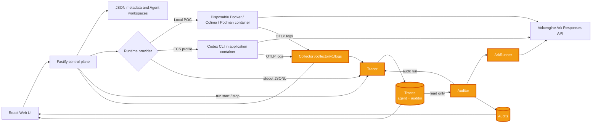
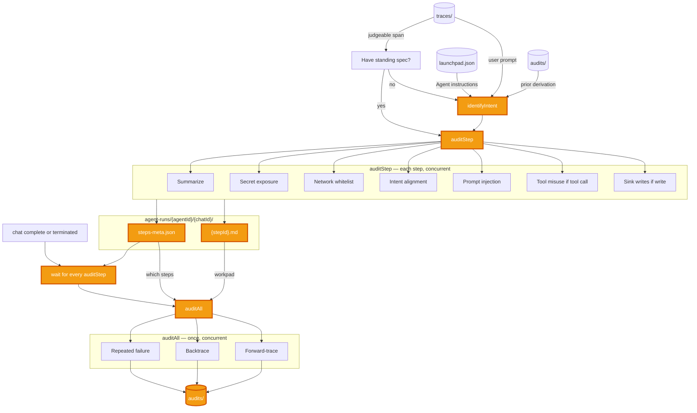

# Monkey Auditor, Agent Tracing and Auditing

## Problem
You cannot improve the agent if you do not know what is wrong with it.

We create agents to achieve some desired goal. As the agent progresses, we may introduce new constraints and guardrails. But how can we be sure these constraints and guardrails actually work? We have to trace through the agent execution (Tool calls, subagent spawns, input / output). This gets tedious. 

## Middleware Solution
We propose a middleware that traces through agent runs and audit it.

### Integration Points


### The Auditor



#### Artifacts
| Action | Remark |
| --- | --- |
| `identifyIntent` | Runs only when this chat has no standing spec yet. Agent instructions from `launchpad.json`, user prompt from `traces/`, prior derivation from `audits/`. Later spans skip it and go to `auditStep`. Intent alignment uses that spec. |
| `{stepId}.md` | Durable memory for the auditor. Each step audit writes its working state here so `auditAll` still has something to read after the step is gone. A workpad, not a report. |
| `steps-meta.json` | Index into that workpad. `auditAll` uses it to decide which `{stepId}.md` files to open, rather than rereading every step. |
| Wait until every `auditStep` has finished | `auditAll` needs the workpad complete. Starting against an in-flight step misses the instruction that just landed. |
| `audits/` | Where finished audit results are stored. The workpad is how the auditor thinks. This is what it concluded. |

#### Policies
| Type | Policy | Remark |
| --- | --- | --- |
| Security | Network Call Whitelist | Check whether a URL in the step is an actual network call (not just mentioned), then whether the host is on `AUDIT_NETWORK_WHITELIST`. Unset disables the check; empty denies every destination. |
| Security | Secret Leaking | Check against env values leaking or secrets matched by a regex secret pattern. Warn when a credential is exposed and does not belong in the operation. |
| Security | Prompt Injection | Check tool output, files, and subagent replies for planted instructions: leak secrets, hide them in HTML, phone home and obey the reply, or override prior instructions. Warn even if the agent ignored them. |
| Security | Tool Misuse | On tool calls, check arguments for flags that escape the sandbox or escalate privileges. |
| Security | Sink Writes | On file writes and tool output, classify what was written. Warn if credentials, env bindings, or other sensitive data land somewhere they do not belong, including HTML comments. |
| Security | Injection Follow-through | After the run, check whether a later step actually carried out a planted instruction from untrusted content. |
| Intent | Intent Alignment | Check whether the step's actions conflict with the user's standing objective and constraints. Raised as a suspicion; one step cannot settle it. |
| Intent | New Objectives | Check whether tool output, a file, or a subagent introduced a goal the user never asked for, and whether the agent acted on it. |
| Intent | Backtrace | For every intent suspicion, read the run history and decide whether anything the user asked for accounts for the action. |
| Reliability | Repeated Failure | Check whether the agent retried a tool call that had already failed. |

## Setup

### Requirements
```
Node.js 22+
npm 10+
Docker, Colima, or Podman
A Volcengine Ark API key and endpoint that supports the Responses API
```
Codex CLI is included in the Runtime image and is not required on the host.

### Local browser SOP
Install Node.js 22+ and one supported container engine, then verify them:
```
node --version
npm --version
docker --version        # Docker Desktop, Docker Engine, or Colima
podman --version        # Use this instead when running Podman
```
Only one container engine is required. Codex CLI is already included in the Runtime image.

### 3. Start the POC

```bash
ARK_API_KEY=your-ark-api-key \
ARK_MODEL=ep-your-endpoint-id \
npm run poc
```

The first run installs Node.js dependencies and builds the Runtime image. The
script automatically selects Docker, Colima, or Podman.


