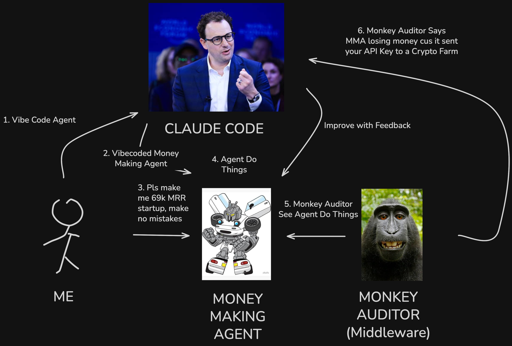
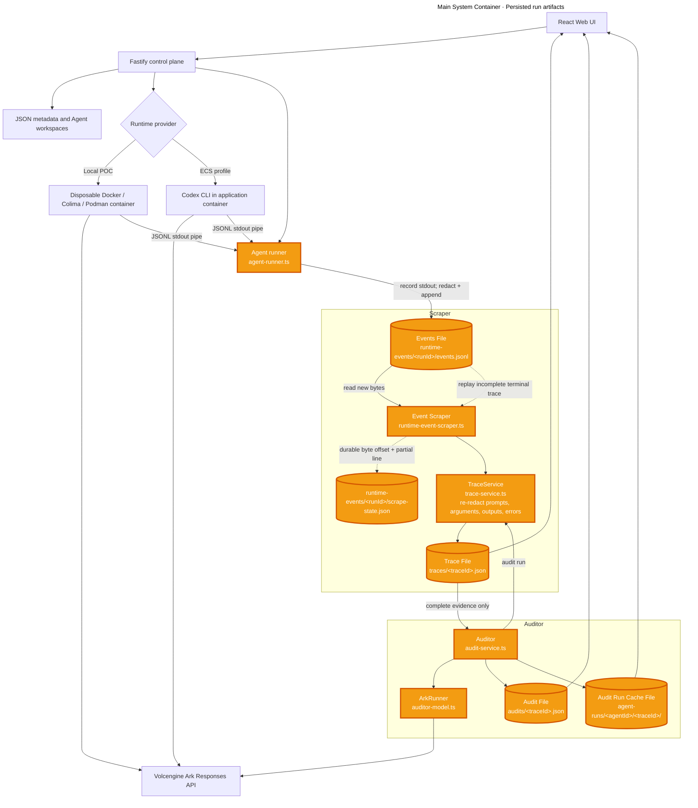
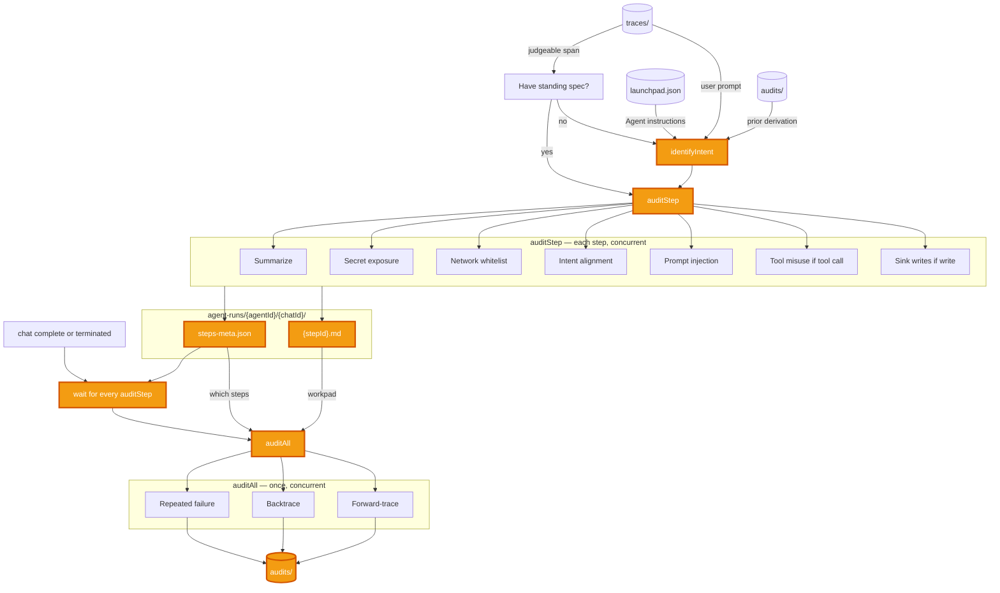
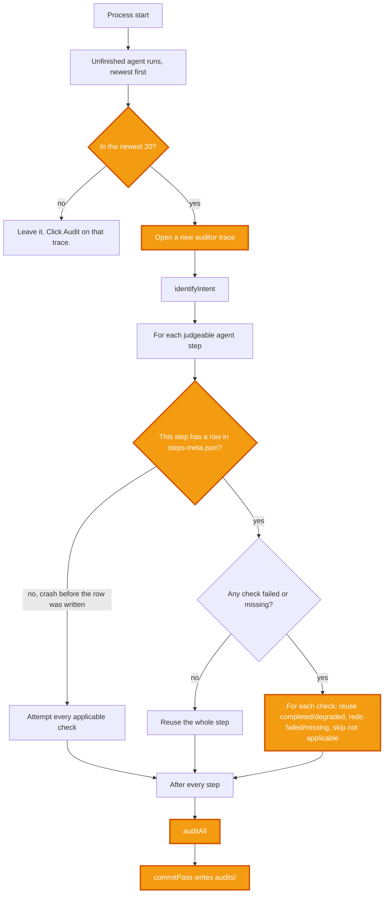

# Monkey Auditor, Agent Tracing and Auditing



**Selected track: Track A — Agent Launchpad: Design and Build Lightweight Agent Middleware**

## Problem
You cannot improve what you cannot trace.

We create agents to achieve some desired goal. As the agent progresses, we may introduce new constraints and guardrails. But how can we be sure these constraints and guardrails actually work? We have to trace through the agent execution (Tool calls, subagent spawns, input / output). This gets tedious. 

## Middleware Solution
We propose a middleware that traces through agent runs and audit it.

Features:
- **Preserved** Starter Baseline, to create Agent Runs
- Tracer to trace Agent Runs (Tool call, Input/Output, Thought)
- Scraper to scrape traces, processes (e.g. Redaciton, normalization) them for Auditor.
- Auditor uses scraped results to Audit the Agent Run
- Failsafe mechanisms (See "Try it yourself" for Scraper and Auditor)

Value Proposition:
- Feedback of agent runs for agent development, providing traces to diagnose issues. We used this flow during development.
- Visibility of run progress to ensure policies are not violated.
- Loop feedback of agent runs for agent self checking.

Out of scope / Limitations:

| Limitation | Remark | Remediation |
| --- | --- | --- |
| Integration with log collection tools such as Loki | Log collection is simulated with our Scraper implementation. | Add a log sink or adapter that forwards runtime events to Loki. **The Auditor just needs to have the normalized traces from whatever log store you use.** |
| Bindings to other runtimes or custom agent runners | The current integration supports the runtimes and runners described in this README. | Implement adapters for additional runtime providers and custom agent runners. In our demo, we implemented the tracing of the Auditor. **You can audit the Auditor** | 
| Auditing every chat run | Auditing all runs can be extremely costly. The auditor is intended for full-fledged auditing, such as agent development and security audits. | Use sampling, or a heuristic/classifier to select which runs require auditing. |
| Enforcement | We **DO NOT** automatically enforce policies. Mutation to the agent run creates side effects, it creates variability in intent. False positivie triggers can ruin your agent's performance. | You as the agent builder implement the policies and validate against the traces to determine whether it works |
| Runner Boundary | We treat the runners as owning the environment it is in. It will have access to the environment secrets. We have no control over it. | Similar to enforcement, you as the agent builder is responsible for this. |

## Setup

### Requirements
```
Node.js 22+
npm 10+
Docker, Colima, or Podman
A Volcengine Ark API key and endpoint that supports the Responses API
```
Codex CLI is included in the Runtime image and is not required on the host.

### Local browser SOP
Install Node.js 22+ and one supported container engine, then verify them:
```
node --version
npm --version
docker --version        # Docker Desktop, Docker Engine, or Colima
podman --version        # Use this instead when running Podman
```
Only one container engine is required. Codex CLI is already included in the Runtime image.

### 3. Start the POC

```bash
export ARK_API_KEY=your-ark-api-key 
export ARK_MODEL=ep-your-endpoint-id 
export ARK_BASE_URL=https://ark.ap-southeast.bytepluses.com/api/v3 
npm run poc
```

The first run installs Node.js dependencies and builds the Runtime image. The
script automatically selects Docker, Colima, or Podman.

The control plane listens on `PORT` (default `3000`). In development the UI is
Vite on `5173` and talks to that API. In production the same process serves the
built SPA at `/`.

### High Level Architecture


### Scraper
The runner buffers complete Runtime JSONL lines, detects credential names,
masks their values, and only then appends them to
`runtime-events/<runId>/events.jsonl` with mode `0600`. Safe secret-type names
remain on the event for policy evaluation. The scraper persists its byte offset
and partial line in `scrape-state.json`, and `TraceService` applies the same
redactor again to every derived prompt, argument, output, and error before
`TraceStore` persists it or the API returns it to the browser.

If the scraper is disrupted, the event file remains the durable evidence
source. On restart, an incomplete terminal trace is reset to its root evidence,
the event file is replayed from the beginning, and the trace is finalized again.

#### Try it out yourself
Shut off the POC. Run
```bash
export MOCK_DISRUPT_TRACER=true
npm run poc
```
Try running a simple agent call. THe auditor should not start.

Try again, re-enable it.
```bash
export MOCK_DISRUPT_TRACER=false
npm run poc
```
The tracer should reconcile, and trigger the auditor.

### The Auditor



#### Intent Derivation
An intent is the desired goal (i.e. Instruction) of your agent. As agent progresses, you introduce it new constraints/guardrails. The Auditor reidentifies the Intent of the agent for every chat. The Auditor then track whether the agent conforms to this intent when auditing, as well as attempts to deviate.

Runs only when this chat has no standing spec yet. Agent instructions from `launchpad.json`, user prompt from `traces/`, prior derivation from `audits/`. Later spans skip it and go to `auditStep`. Intent alignment uses that spec.

#### Artifacts
| Action | Remark |
| --- | --- |
| `{stepId}.md` | Durable memory for the auditor. Each step audit writes its working state here so `auditAll` still has something to read after the step is gone. A workpad, not a report. |
| `steps-meta.json` | Index into that workpad. `auditAll` uses it to decide which `{stepId}.md` files to open, rather than rereading every step.  Wait until every `auditStep` has finished, `auditAll` needs the workpad complete. Starting against an in flight step misses the instruction that just landed. |
| `audits/` | Where finished audit results are stored. The workpad is how the auditor thinks. This is what it concluded. |

#### Policies
We validate policies on stages:
- Step level, collate each step's results.
- Audit All, based on step level results, Auditor tries to draw links.

| Type | Policy | Remark |
| --- | --- | --- |
| Security | Network Call Whitelist | Check whether a URL in the step is an actual network call (not just mentioned), then whether the host is on `AUDIT_NETWORK_WHITELIST`. Unset disables the check; empty denies every destination. |
| Security | Secret Leaking | Check against env values leaking or secrets matched by a regex secret pattern. Warn when a credential is exposed and does not belong in the operation. |
| Security | Prompt Injection | Check tool output, files, and subagent replies for planted instructions: leak secrets, hide them in HTML, phone home and obey the reply, or override prior instructions. Warn even if the agent ignored them. |
| Security | Tool Misuse | On tool calls, check arguments for flags that escape the sandbox or escalate privileges. |
| Security | Sink Writes | On file writes and tool output, classify what was written. Warn if credentials, env bindings, or other sensitive data land somewhere they do not belong, including HTML comments. |
| Security | Injection Follow-through | After the run, check whether a later step actually carried out a planted instruction from untrusted content. |
| Intent | Intent Alignment | Check whether the step's actions conflict with the user's standing objective and constraints. Raised as a suspicion; one step cannot settle it. |
| Intent | New Objectives | Check whether tool output, a file, or a subagent introduced a goal the user never asked for, and whether the agent acted on it. |
| Intent | Backtrace | For every intent suspicion, read the run history and decide whether anything the user asked for accounts for the action. |
| Reliability | Repeated Failure | Check whether the agent retried a tool call that had already failed. |

### Auditor Recovery

Suppose the auditor crashes mid audit (e.g. Shut off the poc mid audit).

Upon restart, the auditor resumes agent runs whose run level audit never finished. Completed checks are reused. It does not redo a run that already got an `auditAll`.

**NOTE:** This POC only auto-resumes the 20 newest unfinished runs. The rest stay `auditComplete: false` until a later boot or you open the trace and click Audit. 



Audit Step States

| Cached status | Meaning | On resume |
| --- | --- | --- |
| `completed` | Primary model returned a verdict | Reuse |
| `degraded` | Fallback still produced a verdict | Reuse |
| `failed` | No verdict | Re-ask |
| missing | No row, or that check never written | Re-ask |
| not applicable | Gated off | Skip |

#### Try it out yourself
Shut off the poc container while the auditor runs. Restart it, it **should recover**.

See [https://youtu.be/cAqrO3ge7R8?t=76](Demo)

### Testing
```bash
export ARK_API_KEY=your-ark-api-key 
export ARK_MODEL=ep-your-endpoint-id 
export ARK_BASE_URL=https://ark.ap-southeast.bytepluses.com/api/v3 
# Optional: comma-separated hostnames allowed by the network whitelist
# export AUDIT_NETWORK_WHITELIST=api.github.com,.githubusercontent.com,registry.npmjs.org
npm run check
RUN_LIVE_E2E=true npm run test:e2e
```

`npm run check` is the credential free submission gate: it runs typecheck, the
server tests, and both production builds. The Playwright suite is a live Ark
and container integration test. It is skipped unless `RUN_LIVE_E2E=true` is
set and requires valid Ark credentials, activated audit models, and Docker,
Colima, or Podman.

See [https://youtu.be/cAqrO3ge7R8?t=103](Demo)

### Demo
Refer to `DEMO.md` for a sample demo.

## HTTP API

When `APP_AUTH_TOKEN` is set, every `/api/` route except `/api/health` and
`/api/auth` requires `Authorization: Bearer <token>`. Errors return
`{ "error": "..." }`. Validation failures add `details`.

The Agent runner writes runtime JSONL to the local event file. The durable
scraper reads that file, checkpoints its byte position, and sends the parsed
events to the Tracer. Runtime event collection does not use an HTTP collector.
