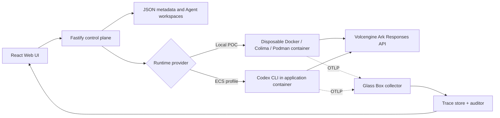

# Volc Agent Launchpad

A minimal Agent platform for three-day middleware hackathons. It provides Agent
CRUD, a browser Playground, persistent workspaces, and Codex CLI backed by the
Volcengine Ark Responses API.

Run it locally with Docker, Colima, or rootless Podman, or deploy it to
Volcengine ECS.

> [!WARNING]
> This is a single-user proof of concept. It intentionally has no identity,
> tracing, audit, or hardened sandbox middleware. Do not use production data or
> credentials. See [SECURITY.md](SECURITY.md).

## Screenshots

### Agent Playground


### Create an Agent


## Features

- React and TypeScript Web UI
- Agent create, edit, start, stop, delete, and multi-turn chat
- Fastify control plane with asynchronous Run state
- Persistent Agent workspaces and Codex sessions
- Disposable Docker, Colima, or Podman container for each local turn
- Glass Box trace and audit middleware: per-step spans, secret masking,
  intent-alignment and network-policy checks
- Failure attribution that says whether a failed Run is the Agent's fault, with
  a remedy and a link from the failing step to the model call that planned it
- A versioned intent timeline showing what changed the Agent's specification,
  when, and why — with one-click revert
- Prior-run context carried between Runs on the same session, established from
  the trace itself so it survives an unavailable audit model
- Docker and Terraform deployment paths for Volcengine ECS

## Requirements

- Node.js 22+
- npm 10+
- Docker, Colima, or Podman
- A Volcengine Ark API key and endpoint that supports the Responses API

Codex CLI is included in the Runtime image and is not required on the host.

## Local browser SOP

### 1. Check the local tools

Install Node.js 22+ and one supported container engine, then verify them:

```bash
node --version
npm --version
docker --version        # Docker Desktop, Docker Engine, or Colima
podman --version        # Use this instead when running Podman
```

Only one container engine is required. Codex CLI is already included in the
Runtime image.

### 2. Clone the repository

```bash
git clone <repository-url> volc-agent-launchpad
cd volc-agent-launchpad
```

Skip this step when already working from the repository root.

### 3. Start the POC

```bash
ARK_API_KEY=your-ark-api-key \
ARK_MODEL=ep-your-endpoint-id \
npm run poc
```

The first run installs Node.js dependencies and builds the Runtime image. The
script automatically selects Docker, Colima, or Podman.

### 4. Open the browser

Visit <http://localhost:3000>, or open it from the terminal:

```bash
open http://localhost:3000       # macOS
xdg-open http://localhost:3000   # Linux desktop
```

In the Web UI:

1. Select **Create Agent**.
2. Enter a name, description, and workspace instructions.
3. Select **Create Agent** again.
4. Enter a task in the Playground, for example:

   ```text
   Create a TypeScript hello-world CLI, add a test, and run it.
   ```

The Agent can write files, run commands, and continue the same Codex session in
later messages.

### 5. Stop and resume

Press `Ctrl+C` in the startup terminal. The script removes temporary Runtime
containers but keeps Agent workspaces and conversations.

- macOS state: `~/.volc-agent-launchpad/`
- Linux state: `.local/`
- Custom location: set `LOCAL_POC_DATA_ROOT`

Run the same `npm run poc` command to continue later.

### Select a specific container engine

Force Podman when multiple engines are installed:

```bash
CONTAINER_ENGINE=podman \
ARK_API_KEY=your-ark-api-key \
ARK_MODEL=ep-your-endpoint-id \
npm run poc
```

Colima uses `CONTAINER_ENGINE=docker` because it exposes the Docker CLI.

For a clean Linux host, follow the
[rootless Podman setup](docs/LOCAL_POC.md#rootless-podman-on-linux).

## Docker Compose

Create and edit the configuration:

```bash
./scripts/bootstrap-local.sh
```

Required values in `.env`:

```dotenv
ARK_API_KEY=your-ark-api-key
ARK_MODEL=ep-your-endpoint-id
APP_AUTH_TOKEN=replace-with-at-least-24-random-characters
```

Start the application:

```bash
docker compose up --build
```

Open <http://localhost:3000>. Stop it without deleting Agent data:

```bash
docker compose down
```

## Development

```bash
npm install
cp .env.example .env
npm install --global @openai/codex@0.111.0
npm run dev
```

- Web UI: <http://localhost:5173>
- API: <http://localhost:3000>

Use local paths in `.env` when running outside Docker:

```dotenv
APP_DATA_DIR=.data
AGENT_WORKSPACE_ROOT=workspaces
CODEX_HOME=codex-home
```

## Deployment

- [Existing Linux ECS with Docker](docs/DEPLOYMENT.md#existing-linux-ecs)
- [Complete Volcengine environment with Terraform](docs/DEPLOYMENT.md#terraform-deployment)
- [Local Docker, Colima, and Podman details](docs/LOCAL_POC.md)

The existing-ECS script deploys from the current source tree:

```bash
cp .env.example .env.production
./scripts/deploy-existing-ecs.sh .env.production
```

The Terraform path provisions VPC, subnet, security group, ECS, and EIP:

```bash
cp deploy/volcengine/terraform.tfvars.example \
  deploy/volcengine/terraform.tfvars
./scripts/deploy-volcengine.sh
```

## Configuration

| Variable | Default | Purpose |
| --- | --- | --- |
| `ARK_API_KEY` | Required | Ark model API key. |
| `ARK_MODEL` | Required | Responses-capable endpoint or model ID. |
| `ARK_BASE_URL` | Beijing v3 endpoint | Ark OpenAI-compatible API URL. |
| `APP_AUTH_TOKEN` | Empty on loopback | Shared demo token; use 24+ random characters remotely. |
| `RUNTIME_PROVIDER` | `local-process` | `container` for disposable local Runtime containers. |
| `AGENT_RUNTIME` | `codex` | `claude-code` to run Agents through Claude Code CLI instead. See [Agent runtime](#agent-runtime). |
| `ANTHROPIC_API_KEY` | Unset | Console API key for `claude-code`; billed against your Console credit balance. |
| `CLAUDE_CODE_OAUTH_TOKEN` | Unset | Subscription token from `claude setup-token` for `claude-code`; used in preference to the API key. |
| `CODEX_SANDBOX_MODE` | `workspace-write` | Codex inner sandbox mode. |
| `CODEX_TIMEOUT_MS` | `600000` | Maximum duration of one turn. |
| `LOCAL_POC_DATA_ROOT` | Platform-specific | Local metadata, workspace, and session directory. |
| `AUDIT_ENABLED` | `true` | Trace and audit middleware. |
| `AUDIT_NETWORK_WHITELIST` | Unset | Hostnames the Agent may reach; unset disables the check. |

See [.env.example](.env.example) for all Runtime and resource-limit options,
and [docs/GLASS_BOX.md](docs/GLASS_BOX.md) for the audit middleware options.

## Agent runtime

The Launchpad runs every Agent turn through one configurable Runtime CLI.
`AGENT_RUNTIME` selects which one — it's a single, server-wide setting, not
a per-Agent choice, and every other part of the platform (workspace
persistence, multi-turn resume, container execution, Glass Box tracing and
auditing) works the same regardless of which one is active.

| `AGENT_RUNTIME` | CLI used | Notes |
| --- | --- | --- |
| `codex` (default) | [Codex CLI](https://github.com/openai/codex) | See [Requirements](#requirements) — included in the Runtime container image, no host install needed for the Local POC or Docker Compose paths. |
| `claude-code` | [Claude Code CLI](https://code.claude.com/docs) | Also included in the Runtime and application images; needs a subscription token or Console API key — see below. |

Both CLIs are baked into the images, so switching `AGENT_RUNTIME` does not
require rebuilding. A host install is only needed when running the Agent
outside a container (`RUNTIME_PROVIDER=local-process` on the host, i.e. the
`npm run dev` path).

### Switching to Claude Code

1. Set the runtime and its credential. Claude Code talks to Anthropic
   directly, so it needs its own credential **in addition to** the Ark
   values — Ark still powers the Glass Box audit models whichever runtime
   is selected. Pick **one** of the two:

   **Subscription** (Claude Pro/Max/Team/Enterprise). Generate a one-year
   token once with `claude setup-token`, then:

   ```bash
   AGENT_RUNTIME=claude-code \
   CLAUDE_CODE_OAUTH_TOKEN=your-setup-token \
   ARK_API_KEY=your-ark-api-key \
   ARK_MODEL=ep-your-endpoint-id \
   npm run poc
   ```

   **Console API key**, billed against your Console credit balance, which is
   separate from any subscription — a run fails with
   `billing_error · Credit balance is too low` when that balance is empty:

   ```bash
   AGENT_RUNTIME=claude-code \
   ANTHROPIC_API_KEY=your-anthropic-api-key \
   ARK_API_KEY=your-ark-api-key \
   ARK_MODEL=ep-your-endpoint-id \
   npm run poc
   ```

   Set only one. Claude Code ranks `ANTHROPIC_API_KEY` above
   `CLAUDE_CODE_OAUTH_TOKEN` and always uses a present API key in headless
   (`-p`) mode, so setting both would quietly bill the Console balance; the
   Launchpad forwards just the token when both are configured, and says
   which one it used at startup.

   For Docker Compose, put the chosen value in `.env` instead.

2. Optional overrides:

   | Variable | Default | Purpose |
   | --- | --- | --- |
   | `CLAUDE_CODE_BIN` | `claude` | Path to the Claude Code CLI binary. |
   | `CLAUDE_CODE_HOME` | `claude-home` | Claude Code's config/session/credentials directory (`CLAUDE_CONFIG_DIR`) — the runtime-agnostic analog of `CODEX_HOME`. |

No other configuration changes are needed. The Launchpad points Claude
Code's own OTLP telemetry exporter at the same collector Codex uses, so
traces, masking, and audits keep working without extra setup.

Because the Launchpad gives Claude Code its own `CLAUDE_CODE_HOME` rather
than your personal `~/.claude`, it never picks up a host `/login` session —
it authenticates only with whichever credential you set above.

The sidebar reports the active runtime and the model it is running on. Under
`codex` that is `ARK_MODEL`; Claude Code resolves its own model from the
account behind the credential, so there is no model setting here and the
sidebar reads "model resolved at run time" until the first Run reports one.

**Known limitation:** Claude Code's OTLP telemetry does not carry tool call
*output* content (only input and byte sizes), so the audit pipeline's
secret-detection and network-whitelist checks see less of what happened for
a Claude Code-backed Agent than for a Codex one. See
[docs/GLASS_BOX.md](docs/GLASS_BOX.md).

## Troubleshooting a failed run

A failed Run's error names the cause directly in the Playground, for example:

```text
docker Runtime exited with code 1: assistant error: billing_error ·
Credit balance is too low · api_error_status=400 ·
full transcript: /app/data/run-logs/<runId>.log
```

The transcript that error points at holds the whole picture — the Runtime
binary and argv, the reported error, and the Runtime's raw stdout and stderr:

```text
# Runtime failure transcript
runtime:  claude-code
runId:    ff4c506d-0410-4762-8cb4-eb88b8c5e66b
argv:     run --rm --init ... volc-agent-runtime:local claude -p ...
error:    docker Runtime exited with code 1: ...

## stdout
{"type":"system","subtype":"init","session_id":"...","model":"..."}
...
```

It is written under `APP_DATA_DIR` only when a Run fails, with mode `0600`,
and passes through the same secret masking as traces and audits. Reach for it
whenever a Run dies before producing any trace spans — that is the case where
the Glass Box UI has nothing to show and the transcript has everything.

## How it works



The first turn uses `codex exec`; later turns resume the stored Codex thread.
Deleting an Agent archives its workspace under `workspaces/.deleted/`.

Each turn is also recorded as a trace and audited against the user's stated
intent and a network policy. See [docs/GLASS_BOX.md](docs/GLASS_BOX.md).

See [docs/ARCHITECTURE.md](docs/ARCHITECTURE.md) for component and extension
boundaries.

## Validation

```bash
npm run check
terraform fmt -check -recursive deploy/volcengine
docker compose config
```

### Live Playwright pipeline

The opt-in browser suite creates a **Documentation Agent**, runs five real
multi-turn tasks, and verifies trace rendering, audit findings, conversation
continuity, the network whitelist, and a human-confirmed intent update. It uses
an isolated state directory under `/tmp` and is intentionally separate from
`npm run check` because it requires Ark, internet access, and a running Docker,
Colima, or Podman engine.

Install Chromium once, then run the suite:

```bash
npx playwright install chromium
RUN_LIVE_E2E=true \
ARK_API_KEY=your-ark-api-key \
ARK_MODEL=ep-your-endpoint-id \
npm run test:e2e
```

The test server automatically enables intent confirmation and configures
`tanstack.com`, `youtube.com`, and YouTube subdomains as permitted destinations.
Override `E2E_PORT` if port `3100` is already in use. Failure screenshots,
videos, and Playwright traces are retained under `test-results/`; the HTML
report is written to `playwright-report/`.

`npm run eval:intent -w @launchpad/server` scores the intent classifier against
its dataset. It calls a real model, so it is not part of `npm run check`.

## Documentation

- [Architecture](docs/ARCHITECTURE.md)
- [Glass Box: trace and audit](docs/GLASS_BOX.md)
- [Local POC](docs/LOCAL_POC.md)
- [Deployment](docs/DEPLOYMENT.md)
- [Hackathon extension guide](docs/HACKATHON_EXTENSION_GUIDE.md)
- [Security policy](SECURITY.md)
- [Contributing](CONTRIBUTING.md)

## License

[MIT](LICENSE)
