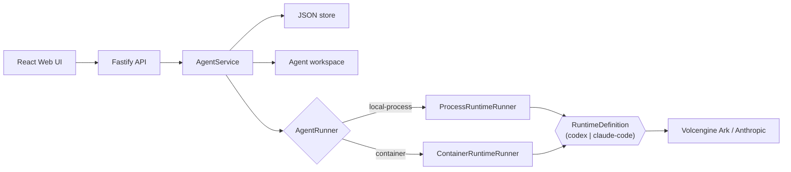

# Architecture

Volc Agent Launchpad is a single-node control plane for hackathon use.



## Components

### Web UI

Lists Agents, manages lifecycle actions, submits prompts, and polls asynchronous
Runs. It never receives the Ark API key.

### Fastify API

Validates requests, protects remote demos with a shared bearer token, and
serves the compiled Web UI. The token is not user identity or authorization.

### AgentService

Coordinates lifecycle state, persistence, workspaces, and Runs. One Agent can
have only one active Run.

```text
ready -> busy -> ready
  |       |
  v       v
stopped  error
```

Interrupted Runs become `cancelled` after a restart.

### Storage

```text
data/launchpad.json       Agent, message, and Run metadata
workspaces/AgentID/       Agent-created files
workspaces/.deleted/      Archived deleted workspaces
codex-home/ or claude-home/   Codex or Claude Code config/session data
                               (whichever AGENT_RUNTIME selects)
```

`JsonStore` serializes writes and atomically replaces one JSON file. It supports
one process only.

### Agent runtimes

Which CLI actually executes a turn is a `RuntimeDefinition`
(`apps/server/src/runtimes/types.ts`) — a data object, not a class: bin
path, home directory/env var, argv builder, stdout-line parser, telemetry
bootstrap, and OTLP trace-event adapter. `codexRuntime` and
`claudeCodeRuntime` (`apps/server/src/runtimes/codex.ts`,
`apps/server/src/runtimes/claude-code.ts`) are the two concrete
definitions; `selectRuntime` (`apps/server/src/runtimes/index.ts`) picks
one from the `AGENT_RUNTIME` config value.

Two generic `AgentRunner` implementations execute whichever
`RuntimeDefinition` is selected, driven entirely by that object:

- `ProcessRuntimeRunner` (`apps/server/src/agent-runner.ts`) runs the
  Runtime CLI as a host child process (ECS profile, or local development).
- `ContainerRuntimeRunner` (`apps/server/src/container-runtime-runner.ts`)
  starts one disposable Docker, Colima, or Podman container for every local
  turn (Local POC profile).

Both use argv-only process execution, bound output and time, resume the
stored thread, and escalate termination after a grace period — none of that
is runtime-specific.

## Deployment profiles

| Profile | Control plane | Agent execution |
| --- | --- | --- |
| Local POC | Host Node.js | Disposable local container |
| ECS | Application container | Agent runtime process in the same container |
| Local development | Host Node.js | Host Agent runtime process |

## Extension seams

| Track | Primary seam | Expected change |
| --- | --- | --- |
| Glass Box | `AgentRunner`, `AgentRun` | Emit and display correlated execution events. |
| Bouncer | API routes, Agent ownership | Add identity and server-side authorization. |
| Kill Switch | `AgentRunner` | Add threat-specific policy or a stronger sandbox. |

The current container or ECS instance is the POC trust boundary. Ordinary
containers are not hardened multi-tenant isolation.
