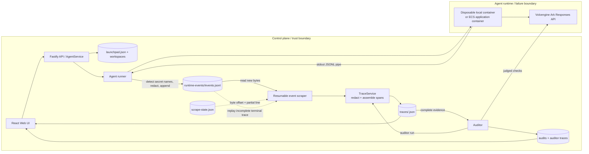

# Architecture

Monkey is a single-node control plane for the Track A Glass Box POC. The
judge-facing overview is the diagram in [README.md](../README.md); this document
defines the same deployed pipeline and its boundaries in more detail.



There is no active OTLP collector or `/collector/v1/logs` ingestion route.
Parsers retained inside `TraceService` are internal compatibility code, not a
deployed boundary.

## Runtime and evidence flow

`AgentService` owns lifecycle state and starts the selected `AgentRunner`. In
the local POC, `ContainerRuntimeRunner` creates one disposable Docker, Colima,
or Podman container per turn. In the ECS profile, `ProcessRuntimeRunner` starts
the Runtime CLI inside the application container. Both execute the selected
Codex or Claude Code runtime definition.

The runner owns the Runtime stdout pipe. It buffers complete JSONL records,
detects credential names, masks their values, and only then appends records to
`runtime-events/<runId>/events.jsonl` with mode `0600`. Safe secret-type names
remain as policy evidence; plaintext configured values must not cross this
persistence boundary.

The scraper reads newly appended bytes and stores its byte offset and any
partial line in `scrape-state.json`. `TraceService` normalizes Runtime events,
assembles the span tree, and applies the same redactor again to raw events and
every derived prompt, tool argument, output, and error. `TraceStore` then
atomically persists the redacted record at `traces/<traceId>.json`.

The auditor consumes persisted traces as a separate stage. It cannot mutate an
Agent trace and writes findings, audit memory, and its own trace separately.
Deterministic policies cover network destinations, secret exposure, suspicious
writes, prompt injection patterns, and repeated failures; model-backed checks
judge relevance and intent. A model outage degrades audit health without
discarding deterministic evidence or blocking the Agent run.

## Recovery and failure boundaries

- `events.jsonl` is the append-only runtime evidence source. A scraper failure
  does not require the Agent turn to be rerun.
- On restart, an incomplete terminal trace is reduced to its root evidence,
  its persisted runtime events are replayed from the beginning, and normal
  finalization runs again.
- `scrape-state.json` makes ordinary scraping resumable by recording the last
  durable byte offset and partial record.
- Runtime, provider, policy, Agent, task, and user failures receive distinct
  attribution. Only Agent and task layers imply the Agent's work should change.
- Failed runs also write a redacted `run-logs/<runId>.log` for failures that
  happen before a complete runtime event is emitted.

## Persistence

```text
.data/launchpad.json                         Agent, message, and Run metadata
.data/runtime-events/<runId>/events.jsonl    redacted append-only evidence
.data/runtime-events/<runId>/scrape-state.json
                                             scraper recovery checkpoint
.data/traces/<traceId>.json                  redacted Agent or auditor trace
.data/audits/<traceId>.json                  findings and audit health
.data/agent-runs/<agentId>/<traceId>/        per-step auditor memory
.data/intent/<agentId>.json                  ordered intent versions
.data/context/<traceId>.json                 cross-run context digest
.data/run-logs/<runId>.log                   redacted failed-run transcript
workspaces/<agentId>/                        Agent-created files
```

JSON stores serialize writes and use a temporary file plus atomic rename. The
POC is designed for one control-plane process; shared storage and distributed
locking are outside its scope.

## Deployment profiles

| Profile | Control plane | Agent execution |
| --- | --- | --- |
| Local POC | Host Node.js | Disposable local container |
| ECS | Application container | Runtime process in the same container |
| Local development | Host Node.js | Host Runtime process |

The local container or ECS application container is the POC trust boundary.
Ordinary containers are not hardened multi-tenant isolation. The Web UI never
receives the Ark key, and the Runtime never receives the operator bearer token.

## Verification

```bash
npm run check
RUN_LIVE_E2E=true npm run test:e2e
```

`npm run check` runs typecheck, the default server tests, and both production
builds. The live Playwright suite additionally requires valid Ark credentials,
activated audit models, a supported container engine, and its Runtime image; it
is skipped unless `RUN_LIVE_E2E=true` is set.

Detailed policy behavior, recovery semantics, evaluation results, and known
limitations are documented in [GLASS_BOX.md](./GLASS_BOX.md).
