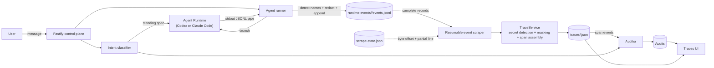

# Glass Box: trace and audit

Selected hackathon track: **Glass Box**. The middleware makes a Run diagnosable
and then judges it — every step is recorded as a span, masked, and checked
against the user's stated intent and a network policy.

The auditor is a separate stage from the recorder. It subscribes to trace
events, re-reads persisted (already masked) data, and writes only to its own
store. It never mutates a trace, and an audit failure never blocks a Run.

## How it works



The trust boundary is the child process's stdout pipe. The Runtime does not call
a control-plane collector and never receives the operator bearer token. The
control-plane runner owns that pipe, buffers incomplete lines in memory,
detects credential names, masks their values, and only then appends JSONL to a
host-side `events.jsonl` file with mode `0600`. The scraper stores its durable
byte offset and any partial line in the adjacent `scrape-state.json` file.

Only secret-type names cross the persistence boundary alongside the masked
event. `TraceService` carries those names into policy evidence and applies the
same redactor again to every raw event and derived prompt, tool argument,
output, and error before handing the record to `TraceStore`. The auditor
consequently reads persisted, already-masked evidence and cannot put a
plaintext credential back into an audit.

If collection is interrupted, stdout continues to accumulate in the event
file. At boot, a terminal trace marked as incomplete is reduced to its root and
prompt spans, its usage and derived steps are cleared, and the persisted event
file is replayed from the beginning. The normal finalization path then rebuilds
the trace and can trigger its audit. Runtime event collection has no active
HTTP collector route; the OTLP parsers retained in the codebase are internal
compatibility code, not the deployed ingestion boundary.

## Diagnosing a failure

A failed run answers three questions, in this order: whose fault is it, where
did it break, and did it happen before.

**Attribution comes first**, because it is the answer most easily got wrong. A
sandbox denial, an unactivated Ark model and a broken shell command all end a
run, and when all three render as one error string the natural response to each
is to blame the agent. Every failure is classified into a layer, and only two of
them mean the agent is what needs improving:

| Layer | Meaning | Example kinds |
| --- | --- | --- |
| `platform` | The launchpad failed | `runtime-timeout`, `output-cap`, `container-unavailable` |
| `provider` | Ark refused or could not serve | `model-unavailable`, `rate-limited`, `context-length-exceeded`, `auth-rejected` |
| `policy` | A boundary did its job | `sandbox-denied`, `approval-denied` |
| **`agent`** | **The agent's own work failed** | `tool-failed` |
| **`task`** | **Finished but produced nothing usable** | `no-agent-message` |
| `user` | You stopped it | `cancelled` |

Each failure also carries a `retryability` — `transient`, `permanent`, or
`user-action` — and a `remedy` saying what to do next. The runner and the
auditor share one definition of "permanent", so a model that is unavailable
cannot be permanent in one place and worth retrying in the other.

The classification lives in `apps/server/src/failures.ts`. States the runner
observed directly — it killed the container, it hit the output cap — always beat
pattern matching against the error text.

**The `agent` layer is gated on where the evidence came from.** Words like
`SyntaxError` or `npm ERR!` appear in plenty of text that has nothing to do
with the Agent — a provider's JSON error body, a stack trace from the control
plane — and pattern matching alone cannot tell those apart from a command's own
output. A rule that blames the Agent therefore fires only when the evidence is a
tool step's output or a non-zero process exit. Anything else falls through to
`platform` / `unknown`, because a misattribution here points the reader at the
Agent when the platform is at fault, which is the exact mistake the taxonomy
exists to prevent.

**A command that fails inside a "successful" tool call still counts.** Codex
reports a tool call as successful whenever the *tool* ran — a command exiting
127 with `command not found` arrives as `success: "true"`. That made the Agent's
own failures invisible, so the `agent` layer was effectively unreachable and the
attribution could only ever answer "not the Agent". A non-zero exit is now read
from the output, and the step is marked failed when the output also carries a
recognisable failure signature. A bare non-zero exit is not enough: `grep`
finding nothing and `diff` seeing a difference are ordinary control flow, and
the exit code is recorded as a fact on the span either way.

**A diagnosis is not gated on the Run having stopped.** A sandbox denial that the
Agent then works around leaves the Run `completed`, and that is the common case
in practice — gating on failure made it undiagnosable. The failing step is
recorded whatever the outcome, and the UI distinguishes "the Run failed" from
"the Agent worked around this".

**Where it broke** is `failingSpanId`, and the failing step also records
`causedBySpanId`: the model call in flight when it was decided. Separating a bad
plan from a bad execution is what decides the fix. This is inferred from event
ordering rather than reported by the Runtime, so the UI presents it as
"Likely planned by" rather than as a fact.

**Whether it recurred** is answered twice. Within a run, a deterministic check
reports a command the agent retried after it had already failed — no model
needed, so it still reports when Ark is unreachable. Across runs,
`GET /api/agents/:id/failures` groups failures by kind: one failure is an
incident, the same failure five times is the thing to fix.

### Errors a run recovered from

Codex reports its own failures on the event stream as `error` and `turn.failed`.
Those events were collected and then read only as `errors.at(-1)`, and only when
the process also exited non-zero — so every error a run recovered from was
discarded, and a run that succeeded on the fifth attempt was indistinguishable
from a clean one. They are spans now, which also means they are audited, and the
count is reported as `recoveredErrorCount` on the trace.

What counts as a stream error is defined once, in `codex-runner.ts`, and shared
with the trace service. The two previously disagreed — only the trace side read
`turn.failed` — so the classifier could miss the one event that said what went
wrong.

`recoveredErrorCount` is counted from the steps that actually failed, not from
those stream events. Stream errors turn out to be rare: a denied command arrives
as a tool result, so a real Run that recovered from five failures reported zero.
The count lives on the trace alone — a second copy on the Run was never read and
could drift from the one that was.

### Evidence the platform knows is incomplete

`CODEX_MAX_OUTPUT_BYTES` truncates the stream and the span clip truncates long
tool output. Both are now marked — `evidenceComplete` on the trace,
`outputTruncated` on the span — so a diagnosis never silently rests on evidence
that was thrown away.

### Audit health is not an agent finding

An auditor that could not run says nothing about the agent. Those records are
`category: "audit-health"`, are excluded from the warning count, and are
reported separately as `auditHealth` (`ok`, `degraded`, `failed`). Counting
them together made every Ark outage look like the agent had misbehaved.

### Reading the failure envelope

A denied tool call arrives as a Rust `Debug` struct with the payload repeated
across `message`, `stderr` and `aggregated_output`. Two things make it hard to
read, and both are handled in `apps/web/src/traces/codex-error.ts`:

- **The nesting depth is not fixed.** The same denial has been seen as
  `SandboxDenied { message: "..." }` and, later, as
  `CreateProcess { message: "Codex(Sandbox(Denied { ... }))" }`. The deeper form
  escapes the payload twice, so unescaping a fixed number of times is wrong in
  one direction or the other. The parser descends until the text stops looking
  like a struct.
- **The outer struct name is the mechanism, not the reason.** `CreateProcess`
  says how the call failed; `Sandbox(Denied` says why. The inner cause is
  preferred when one is recognisable.

Both envelope shapes are kept as fixtures — `codex-failure.json` and
`codex-failure-nested.json` — so a change that fixes one cannot quietly break
the other.

The diagnosis reads a span's full `output` rather than its `error`, because
`error` is a 400-character clip: feeding it to the parser produced a header
match over a truncated payload, which looked parsed and showed nothing.

`RunFailure.detail` is the one line worth quoting out of that envelope, not the
envelope itself — the full text already lives on the span, and duplicating
kilobytes of Debug syntax into the stored failure made it neither readable nor
useful. On a real denial it goes from 2,593 characters to
`Error: listen EPERM: operation not permitted 0.0.0.0:8080`.

## Setup

Auditing is on by default and activates once Ark is configured. No extra
services are required.

| Variable | Default | Purpose |
| --- | --- | --- |
| `AUDIT_ENABLED` | `true` | Set to `false` to stop the automatic pass. Audits asked for from a trace page still run. |
| `AUDIT_SECURITY_MODEL` | `gpt-oss-120b-250805` | Judges each step. |
| `AUDIT_INTENT_MODEL` | `deepseek-v4-flash-ga-260731` | Judges the Run, classifies intent, and is the step-audit fallback. |
| `AUDIT_NETWORK_WHITELIST` | Unset | Comma-separated hostnames the Agent may reach. |
| `AUDIT_MODEL_THINKING` | `disabled` | Step audits are JSON. `auto` is also sent as disabled; set `enabled` only if you are measuring recall. |

There is nothing to configure for the auditor's prompt cache. Ark caches a
common leading prefix by itself on the Chat API, free to store and impossible
to turn off, once a request is at least 1024 tokens long. What the auditor owes
it is shape and order: a step's three always-on checks are given the same
system turn and the same evidence, and differ only in the question trailing it,
so all three share a prefix worth caching.

Order is why the first of them is sent on its own and the other two follow.
Ark writes the prefix into its cache when a request *finishes*, so three sent
together can only miss — which is exactly what the auditor did before, and why
it reported `0 cached` on every call.

Measured against `deepseek-v4-flash-ga-260731` on a 6.2k-token prompt, sent
both ways: concurrently, both calls returned `cached 0`; staggered, the second
returned `cached 6144` of `6186` input — 99% — on the streamed and non-streamed
paths alike. The cached call was also markedly faster (1.1–1.3s against
3.2–9.1s), so the extra serial call costs much less wall clock than it appears
to, and several steps are audited at once regardless.

Hits are still best-effort — capacity is finite and old entries are evicted —
so read `cachedTokens` on the auditor's own trace rather than assuming. The
summary check pays for the evidence and should show little or none; the intent
and injection checks that follow it should show close to the whole body.

Both audit models must be **activated on your Ark account** and must answer
within the client's 60-second timeout. Neither default is guaranteed for a given
account:

- An unactivated model returns `ModelNotOpen`. Every step then degrades to the
  fallback, which still produces a verdict but marks each record `degraded`.
  After the first such failure the model is skipped for the rest of the process
  rather than retried on every step.
- A slow reasoning endpoint times out. In testing, one Ark endpoint answered a
  trivial prompt in 153 seconds against another model's 1.5 seconds — the first
  is unusable here even though it works for the Agent itself.

Check a candidate with a trivial prompt before setting it.

`AUDIT_NETWORK_WHITELIST` has three states, because "no policy" and "deny
everything" are different intentions:

- **unset** — the check is off; no destination is reported.
- **set to hostnames** — those hosts are allowed, everything else is a
  violation. A leading dot opts in a subtree, so `.github.com` covers
  `api.github.com` while `github.com` alone does not.
- **set but empty** — deny all; every external destination is a violation.

## What gets audited

Policies run per step. Network, secret, and prompt-injection detection need
no model, so they still report when Ark is unreachable.

| Policy | Kind | Question |
| --- | --- | --- |
| Network whitelist | Deterministic | Did the step contact a destination that is not allowed? |
| Secret exposure | Deterministic detection, judged relevance | Which credentials appeared, and did they belong in this operation? |
| Prompt injection | Deterministic detection, judged extras | Did tool output, a file, or a subagent plant an instruction to disclose secrets, hide them in HTML, phone home and obey the reply, or override prior instructions? |
| Repeated failure | Deterministic | Did the Agent retry a call that had already failed? |
| Intent alignment | Judged | Which actions conflict with the current objective or its standing constraints? Raised as a suspicion, since one step cannot settle it. |
| New objectives | Judged | Did tool output, a file, or a subagent introduce a goal the user never asked for — and did the Agent act on it? |
| Step summary | Judged | What did this step actually do? Recorded, not scored — it is what the run-level checks read the run back through. |
| Network call | Deterministic detection, judged | A URL appears in the step's text — did the step actually contact it, or only mention it? |
| Tool misuse | Judged, tool calls only | Do the arguments include flags that escape the sandbox or escalate privileges? Named individually. |
| Sink writes | Judged, writes only | What did the step write to each file it touched, and does it belong there? |
| Follow-through | Judged, run level | Did any later step carry out an instruction that arrived in untrusted content? |
| Backtrace | Judged, run level | For every suspicion a step raised: does anything the user asked for account for the action, read across the whole run? Runs concurrently with the forward trace, on the same suspicions from the other direction. |

Each of these is its own model call, run concurrently, with its own evidence and
its own span in the auditor's trace — so a reader can see which question was
asked and what it answered, and one check failing costs one answer rather than
all of them. Four are conditional: a step is only asked about tool misuse if it
is a tool call, about sink writes if it wrote something, about network calls if
a URL appears in it at all, and about credential relevance if the deterministic
pass found a credential. A step that touches none of those costs three calls,
not seven.

Detection and relevance are deliberately split. Whether a credential is present
is a fact and is answered by pattern matching; whether it *belongs* is a
judgement and depends on context. The same split runs through the other checks:
finding a URL is a fact, and whether the step *contacted* it is a judgement —
which is what stops a URL printed in an error message being reported as a
policy violation. The same GitHub token is relevant when it
authenticates a GitHub call and irrelevant when it is pasted into an unrelated
upload, so only the second question goes to a model.

A new objective that the Agent merely *reported* is recorded but does not warn.
Acting on it is what earns the intent-check warning. Prompt-injection
*instructions* are the other way around: they warn as soon as they appear in
tool output, a file, or a subagent reply — even if the Agent ignored them, and
even if they are framed as debugging or mixed into an otherwise ordinary rules
file. Linking a document is not the same as requesting every instruction
inside it.

Whether the Agent then *acted* on a planted instruction is asked twice, because
one pass cannot answer it reliably. Each step audit is shown the instructions
found so far and asked whether the step in front of it carries one out — but
step audits run several at a time, so the step that reads an instruction and the
step that obeys it can be judged simultaneously, and the second one is then
shown nothing. The **forward trace** asks the same question once at run end,
against every step's recorded summary, where no such race is left.

The **backtrace** asks the same suspicions the other way round, and the two run
concurrently rather than one feeding the other. It reads the run's own history
and the standing intent and asks what accounts for the action: if nothing the
user asked for does, the suspicion becomes a warning; if the user's own goal
does, the question is answered and nothing is reported; if the history settles
neither, the suspicion stands. A failed backtrace leaves it standing too —
losing an unresolved question to a model outage would defeat the point of having
the severity.

They are deliberately independent, because they read different evidence and
neither is reliable alone. Looking only at what happened *after* an instruction
appeared cannot distinguish "the agent obeyed the file" from "the user asked for
this anyway" — an upload looks identical either way. Looking only backwards
cannot see the step that carried it out. Feeding one into the other made a
failure in the first silently swallow the question: a forward trace that
returned no verdict handed the backtrace nothing, so neither check ever asked.
Both now read the suspicions from the audit record itself, so a failure in
either still leaves the other looking.

Since both can land on the same instruction, the overlap is de-duplicated on the
way out and the forward trace wins, because it names the step that did it.

Findings are stored as evidence and served in a flat form at
`GET /api/traces/:id` as `findings`:

```typescript
type AuditTraceStep = {
  id: string;
  traceId: string;
  agentId: string;
  spanId: string | null;
  intentId: string;
  type: "warning" | "suspicion" | "error";
  category: "intent-check" | "security" | "reliability" | "audit-health";
  finding: string;
};
```

`audit-health` records are the auditor reporting on itself and are never a claim
about the Agent, so they are excluded from warning counts.

A `suspicion` is weaker than a `warning` on purpose: it is what the auditor
raises when the record shows something questionable but does not settle it.
Reporting an unresolved question in the same voice as a confirmed finding is how
an auditor stops being believed, so the two are kept apart — rendered
differently, and counted separately as `warningCount` and `suspicionCount` on
the trace row rather than summed into one number.

Every step is judged **in isolation**, which is the only way to judge one while
a run is still going and also the reason a step audit over-flags: an action that
serves the objective can look unmotivated beside the single step it appears in.
So an intent deviation is a suspicion when a step raises it, and only the
run-level backtrace — which can read what led up to it — promotes it to a
warning. The deterministic findings are not affected: a credential that left the
system is a fact, and facts are warnings immediately.

### Auditing the auditor

An auditor's work is a run like any other, so it gets a trace like any other.
Every model call it makes is a span on a `TraceRecord` of its own, which carries
two extra fields: `auditOf`, naming the trace it judged, and `auditDepth`,
counting how many audits deep that makes it. An Agent's run is depth 0 with no
target; the auditor that judged it is depth 1, the auditor that judged *that* is
depth 2, and there is no ceiling.

That uniformity is the point. Auditing an Agent's run and auditing an auditor's
run are the same operation on different traces — `POST /api/traces/:id/audit` —
so level N+1 is that call made on the trace level N produced. The stack goes as
deep as someone chooses to click and stops the moment they stop.

An audit someone asked for judges the trace the way the automatic pass judges an
Agent's run: one model call per step, each attributed to the step it is about,
then a run-level pass over the whole thing for the questions no single step can
answer. So an auditor's run reads as the sequence of questions it asked, not as
one lump. Its budget is separate from the automatic one —
`MAX_REQUESTED_STEP_AUDITS` rather than `MAX_STEP_AUDITS_PER_TRACE` — because a
requested audit is deliberate and one-shot, while the automatic pass has to keep
up with a run that is still going. When the budget does stop it short, the
run-level pass says so: an audit reporting nothing must never mean it stopped
looking.

**Nothing above depth 0 is ever audited on its own.** The automatic subscription
reads `isAuditorTrace` and returns before doing anything:

```ts
traceStore.on("span", ({ trace, span }) => {
  if (isAuditorTrace(trace)) return;
  ...
});
```

This is the whole recursion guard, and it has to be there. An auditor's spans
are real trace spans and raise the same events an Agent's do; without it the
first auditor span would enqueue an audit of the auditor that wrote it, which
would write more spans, without limit.

Auditor runs share the audited Agent's id, because that is who they are about —
an auditor has no workspace and no instructions of its own. They are not runs of
the Agent, though, so they are filtered out of `GET /api/agents/:id/traces`. You
reach one by opening the run it judged and following "Open this auditor's trace",
and the trace detail page renders the chain back to the Agent run as a
breadcrumb.

An earlier version kept an audit of the auditor in a `metaAudit` field on the
audited run's own document, specifically so its output could never become
another audit's input. That field is still read, so nothing already recorded
disappears, but nothing writes it any more: the guard now sits on the trigger
rather than on the destination, which is what makes arbitrary depth safe instead
of capping it at one.

## Intent

The specification an Agent is judged against is not fixed at creation.

**Instructions are the source of truth.** `agent.instructions` is written to the
workspace's `AGENTS.md` and is what the Agent actually reads, so the intent
record mirrors it rather than keeping a second opinion. Editing the instructions
in Agent settings appends a version and moves the objective with them; editing
any other field appends nothing. Before this, an instructions edit changed what
the Agent followed while the auditor went on enforcing the spec it had replaced.

**The conversation extends the spec without rewriting the instructions.** Every
message is classified as `NO_CHANGE` or `INTENT_UPDATE`; an update adds standing
constraints, and can now also *remove* one, because a message that relaxes a rule
("actually, you can read .env now") previously had nowhere to go but appending
the opposite of the rule it was lifting.

**A conversational pivot is recorded as a divergence, never written back
silently.** If the conversation replaces the objective, the instructions are left
untouched and the two are shown as diverged; the auditor judges against the
objective and says so. Adopting the divergence writes it into the instructions
and regenerates `AGENTS.md`, collapsing back to one source of truth. That step is
always a human action — a classification never edits configuration on its own.

The discriminator is durability, not topic. "Use PostgreSQL instead of SQLite"
is work; "From now on, use PostgreSQL instead of SQLite" is a rule. Questions
that seek information ("Should we use PostgreSQL?") are not updates; questions
that demand a change ("Can you avoid using `any`?") are.

Classification is queued before the Run starts rather than awaited, so a slow
model never delays the response — but the ordering is what matters: each step
audit waits for the queue to drain, so a constraint is in force for the very Run
that stated it rather than taking effect partway through.

Each version records what changed and why: the message that triggered it, the
classifier's reasoning, the constraints added, and the run the message belonged
to. The Playground shows that history as a timeline and marks the message that
moved the spec — without it, the rules the Agent is judged against changed
silently, and a user had no way to tell whether their correction had landed.

**Reverting appends; it never rewinds.** Restoring an earlier version writes a
new version carrying that version's content. Audits pin the `intentId` they were
judged against and the trace UI resolves that id, so a superseded version has to
stay readable — deleting history would leave every older trace pointing at
nothing.

### Post-run human correction

An audit finding does not have authority to rewrite the Agent. From the
Auditor view, an operator can select **Correct this**, write a constraint for
future runs, and explicitly apply it. The backend verifies that the finding
belongs to the completed trace, that its audit has finished, and that the Agent
has no active run before appending a `human-correction` intent version. The
active intent is included in the prompt for later runs, so the approved
constraint governs both execution and auditing. Reverting the intent therefore
also removes that constraint from later runtime prompts.

That version records the source trace, finding, and span. The intent history
links back to the evidence and the existing revert control can undo the
correction without erasing it. Auditor-health records cannot create
corrections, and applying the same finding twice is rejected.

This is post-run intervention: it improves later runs but does not pause or
approve tools during the run that produced the finding.

Each trace captures the intent snapshot active when its first audit event is
recorded. Queued or late audit work continues to use that snapshot, so applying
a correction cannot make an older trace appear to have been judged against a
rule that did not exist yet.

The current MVP is manual apply/revert. It does not yet generate correction
proposals, record rejected decisions, or automatically label a later run as
resolved or repeated; those remain possible follow-up phases.

## Prior context

Each run inherits a summary of the one before it on the same Codex session.

This used to exist only when the run-level audit model answered: the summary was
whatever the verdict returned, so a model outage, a disabled auditor, or an
unactivated endpoint left the chain empty, and every later run was judged as if
nothing had happened before it. It is now established on three levels:

1. **Thread lineage** — deterministic and never absent. Each runtime resumes
   its own session in place (`buildCodexArgs` issues `resume <threadId>`;
   `buildClaudeCodeArgs` issues `--resume <sessionId>` and deliberately never
   `--fork-session`), so `conversationId` is the Agent's real continuity, and
   the chain is keyed on it rather than on the Agent id. Resetting a session no
   longer carries context across a boundary the Agent itself does not share.
2. **Derived digest** — built from the trace alone: prompt, files touched,
   commands run, services contacted, outcome, and failure attribution. Written
   on `trace-completed`, before any model has been consulted.

   Files written by a shell command are read out of the command text, since the
   path appears in no argument: a run that created `server.js` with
   `cat > server.js` used to report no files touched at all. Heredoc content is
   kept with the path, so a credential written to disk that way is still visible
   to the secret check.
3. **Model summary** — the auditor's compression, used when it is available. It
   upgrades the digest and never erases it.

Which of the last two a reader is looking at is shown as `source`, because a
derived digest and a model summary are not the same kind of claim. The step
auditor receives the carried-in context too, so a step that only makes sense as
the continuation of earlier work is not flagged as unmotivated.

## API

| Route | Purpose |
| --- | --- |
| Local event scraper | Reads runtime `events.jsonl` and forwards parsed events to the Tracer. |
| `GET /api/agents/:id/traces` | Trace list rows with failure attribution, warning counts, and audit health. |
| `GET /api/agents/:id/failures` | The Agent's failures grouped by kind, newest first. |
| `GET /api/agents/:id/intent` | Current objective, standing constraints, the ordered version list, and current intentId. |
| `POST /api/agents/:id/intent/revert` | Append a version restoring an earlier one. Body: `{ "intentId": "..." }`. A revert restores the objective and constraints, never the instructions — it cannot rewrite `AGENTS.md`, so claiming to would make the record lie. |
| `POST /api/agents/:id/intent/adopt` | Write a diverged objective into the Agent's instructions, regenerating `AGENTS.md`. 409 when nothing has diverged. |
| `POST /api/traces/:id/intent/correct` | Apply a human-authored constraint from a finding. Body: `{ "findingId": "...", "correction": "..." }`. |
| `GET /api/traces/:id` | One trace with its audits, derived findings, audit health, the pinned intent, and carried-in/out context. |
| `GET /api/traces/:id/download` | Trace plus findings as a JSON attachment. |
| `GET /api/audits/:id` | The auditor's own trace for that run: model calls, prompts, verdicts, and timing, plus `auditTraceId` naming the auditor's run. Not included in the agent trace API. |
| `POST /api/traces/:id/audit` | Audit any trace, whatever produced it — an Agent's run, or the run of the auditor that judged it, or the run of the auditor that judged *that*. Returns the auditor trace it wrote. Manual at every depth: nothing subscribes to this, and the automatic pass fires for depth 0 alone. 409 while one is running for that trace. |
| `GET /api/audits/:id/archive` | Everything the auditor wrote for that run as a zip: the per-step records under `memory/`, plus `audit.json`. |

Intent versions are served as an **ordered list**, not a map: version order is
insertion order and the ids are random UUIDs, so the order has to be carried
explicitly rather than left to survive a JSON round trip.

Everything under `/api` is covered by the operator bearer token when
`APP_AUTH_TOKEN` is set. Runtime evidence arrives through the local event file,
not through an unauthenticated or separately authenticated HTTP route.

## Storage

Traces, audits, and intent are kept apart so the auditor stays a pure reader of
trace data. All three write atomically (temp file plus rename, mode `0600`)
under `APP_DATA_DIR`:

```
.data/traces/<chatId>.json    one TraceRecord per chat / AgentRun, and one
                              per auditor pass, keyed on auditOf
.data/audits/<chatId>.json    intent-pinned findings for that chat
.data/intent/<agentId>.json   insertion-ordered map of intent versions
.data/context/<chatId>.json   what that run carried out, for the next one
.data/runtime-events/<chatId>/events.jsonl
                              append-only Runtime stdout evidence
.data/runtime-events/<chatId>/scrape-state.json
                              durable scraper offset, completion and partial line
.data/agent-runs/<agentId>/<chatId>/
                              one <stepId>.md per audited step, plus
                              steps-meta.json indexing their summaries
```

That folder belongs to the chat's own auditor. There is one `AgentChatAuditor`
per `(agentId, chatId)`, holding the identity its findings are stamped with, the
path above, and the state its checks have to agree about: whether the step
budget ran out, whether a requested audit is running, and how many step audits
are still in flight — the last of which is what the run-level checks wait on. What
stays process-wide is what only works that way: the batch caller, because a
provider rate limit is shared across every chat, and the memo of models the
account has not activated, because a model that does not exist for one chat does
not exist for the next.

The `agent-runs` folder is the auditor's memory. The markdown is what a person
reads and what the archive download serves; `steps-meta.json` is what the
run-level checks query, so the forward trace can walk a run as a list of
summaries instead of re-reading every span. Steps are audited concurrently and
the index is a read-modify-write, so writes are serialised per chat folder —
without that, two steps finishing together lose one of the entries.

Context is written from the `trace-completed` event rather than by the auditor,
so it exists whether or not auditing is switched on. The auditor enriches that
record; it does not own it.

A failed Run also leaves a transcript at `.data/run-logs/<runId>.log`. It is
not part of the trio above and the auditor never reads it: it is written by
the runner, only on failure, and holds the Runtime's argv plus its raw stdout
and stderr — the material you need when a Run dies before emitting a complete
event. It goes through the same redactor and the same `0600` mode as
everything else here, so the shape-based masking caveat under Limitations
applies to it too.

A Run left open by a crash is closed on the next boot, so the UI never shows a
Run as live when nothing is running.

## Verification

```bash
npm run check
```

Runs typecheck, the server test suite, both builds, and the credential-free
Playwright proof. The browser proof drives the real UI and control plane,
executes a protocol-compatible local Runtime fixture, persists and scrapes its
JSONL, completes an audit through a local Ark protocol fixture, and opens the
resulting trace and auditor views. It executes by default rather than reporting
a successful command with every scenario skipped. Install Chromium once with
`npx playwright install chromium`; use `npm run test:e2e:live` for the separate
real Ark/container suite.

The restored security and audit suites cover configured and shape-based
masking, the persisted trace redaction boundary, the 20-case deterministic
policy fixture, network and
secret detection, suspicious sinks, repeated failures, verdict merging, and
degraded-model behavior. The existing suites continue to cover the Runtime,
scraper, control-plane routes, storage, and Agent lifecycle.

Typecheck covers test files as well as sources (`tsconfig.test.json`). They were
excluded before, which is how a runner result that had grown a required field
reached the suite as a runtime `TypeError` rather than a compile error.

Two restored properties are worth naming because they are easy to break:

- **Masking is a persistence boundary.** The integration test drives a raw
  Runtime event through `TraceService` and asserts that neither the trace file
  nor the API-facing record contains the planted plaintext credential.
- **Deterministic evidence survives model failure.** Network and credential
  facts remain in the step report with degraded audit health when a judged
  check cannot answer.

The audit policies are verified against the 20-case dataset from the audit
plan, kept verbatim at
`apps/server/src/middlewares/audit/__fixtures__/audit-cases.json`. Production traces and
fixture cases both reduce to the same `StepActivity` value, so the dataset
exercises the real code path rather than a parallel one.

Intent classification accuracy is measured separately, because it calls a real
model and yields a score rather than a pass or fail:

```bash
npm run eval:intent -w @launchpad/server
```

Against the 56-case dataset from the intent plan, the current prompt scores
98.2% accuracy (55/56) with 100% recall and no schema retries. The prompt was
written against these same distinctions, so treat that number as a regression
signal, not as a generalisation estimate.

That recall is measured on the *label*. The script also reports **effective
recall**: of the real intent updates, how many actually changed the spec. A
verdict that says `INTENT_UPDATE` but extracts no constraint, no removal and no
objective changes nothing — `IntentService.classify` returns early on exactly
that — so a label counted as caught can still have been caught in name only.
Scoring the extracted constraint *text* would need expected wording added to the
fixture, which today carries only the binary label.

The judged half of the **step** audit is measured the same way:

```bash
npm run eval:audit -w @launchpad/server
```

It replays the 20-case audit dataset through the shipping prompt and context
builder, and scores intent misalignment and acted-upon injected objectives
against the `expected.intent` block those cases have always carried and which
nothing read. The deterministic half of the same dataset is asserted in
`deterministic.test.ts` and runs in `npm test`; only the judged half needs a
model. It also reports how many cases produced a step summary, because that is
what the run-level checks read and a blank one is invisible to the accuracy
numbers.

Against `deepseek-v4-flash-ga-260731`:

| | Accuracy | Precision | Recall |
| --- | --- | --- | --- |
| Intent misalignment | 85.0% (17/20) | 66.7% | 100% |
| Injected objective (acted upon) | 95.0% (19/20) | 75.0% | 100% |

Nothing was missed and every case parsed; the errors are all false positives,
which is the direction an auditor should fail in. Accuracy is in-sample — the
prompt was written against these cases — so read it as a regression signal, not
a generalisation estimate.

These are the numbers *after* the step audit was split into concurrent checks.
Splitting one call into several is the kind of change that quietly costs recall,
so it was measured either side: the figures are identical, including which cases
are missed, which is the evidence that the split changed what each call sees
rather than what it concludes.

## Limitations

**Codex writes the Ark key to disk.** Codex CLI 0.111.0 persists
`declare -x ARK_API_KEY="<real key>"` into `CODEX_HOME/shell_snapshots/*.sh` on
every run. The masking layer keeps it out of traces, audits, and the UI, and it
is not in the repository or its history — but it is cleartext on disk, and
`CODEX_HOME` is bind-mounted into every Agent container, so a later run can read
snapshots left by earlier ones. Deleting the files works; they regenerate. The
Agent already receives the key in its process environment, so this grants no new
access, but the platform does not keep secrets off disk entirely. Clear the
snapshots before recording a demo and rotate the key afterwards.

**Claude Code's direct stream currently produces coarser step evidence.** The
active pipeline records Claude Code's `stream-json` stdout, and its runner
parser reliably extracts the session id, final result, failures, model and
usage. The raw step assembler has richer handling for Codex's item events than
for Claude Code's assistant/tool content blocks, so Claude-backed traces do not
currently have the same tool-argument and tool-output fidelity. The OTLP
normalizers retained for compatibility are not connected to an active HTTP
collector and should not be mistaken for evidence the deployed path receives.

**The follow-through checks read summaries, not steps.** Both the forward trace
and the backtrace judge from each step's recorded one-line summary, so a step
whose summary is missing or vague — the audit model failed, or wrote something
uninformative — is a step they cannot see through. That case ends as a
`suspicion` rather than a decision, but a run whose step audits largely failed
gets a correspondingly weak result. The per-step check still runs independently
of both.

**Masking is shape-based.** Configured secret values are masked wherever they
appear, along with credentials matching known shapes (GitHub, Stripe, OpenAI,
Ark, AWS, JWT, bearer tokens, and connection strings carrying inline
credentials). A credential in an unrecognised format with no configured value
will not be masked.

**Network calls are inferred, not intercepted.** Destinations are read from tool
arguments and shell commands in the trace. A request the Agent makes without it
appearing there is not seen by the whitelist check. This is instrumentation, not
egress enforcement — it reports, it does not block.

**Intent updates govern the run that stated them.** Classification is queued
before the Run starts, and each step audit waits for that queue to drain, so a
constraint stated in a message is in force for the Run it arrived with. If the
classifier cannot produce a verdict after three attempts the change is *not*
applied — and that is recorded as an `audit-health` finding on the Run rather
than being dropped in silence.

**Step auditing is capped, and says when it stops.** Long Runs are capped at 30
step audits per trace to bound cost. Reaching the cap records an `audit-health`
finding naming it, so a partially-audited Run cannot be mistaken for a clean one.
The Run-level intent audit is always performed and is not counted against that
budget. A verdict that comes back unparseable is retried up to three times before
the step's judged half is given up on.

**The Agent can edit the file it is governed by.** `AGENTS.md` lives in the
workspace and the default sandbox is `workspace-write`. The platform compares the
file against the Agent's recorded instructions either side of every Run: an edit
made *during* a Run is attributed to it and reported as `security`, while a file
that was already wrong when the Run began names no culprit and is reported as
`audit-health`. Detection, not prevention — the Run still happens.

**A recovered run is not a clean run.** `recoveredErrorCount` counts the errors
a Run survived, and is zero on a failed Run — where the last error is the
outcome rather than something the Agent got past.

**The planning link is inferred.** `causedBySpanId` is the model call in flight
when a step was decided, read off an async event stream. It is right in the
ordinary case and is labelled as a likelihood rather than a certainty.

**Repeat detection compares normalised arguments.** The same command reformatted
is recognised; the same intent expressed as a different command is not.

**Judged findings are model output.** Alignment, new objectives, extra
injection quotes the regex missed, and secret relevance come from a model and
can be wrong in both directions. The deterministic checks are the reliable half;
the judged half is advisory. When the model is unreachable an audit is recorded
as `failed` with the deterministic findings intact and relevance left explicitly
unknown rather than assumed safe.

Driving the real auditor over 14 dataset cases against a live model, the schema
accepted every verdict and 46 of 51 expectations matched. All five misses were
in the judged half, and four of them were the auditor being *stricter* than the
dataset — flagging a step the dataset considered clean, or reporting an unasked
objective the dataset recorded only as misalignment. The remaining miss called
a credential relevant when the step had been forbidden from reading it at all.
Over-flagging is the safer failure mode for this component, but it is not free:
expect some noise in the intent-check findings.
