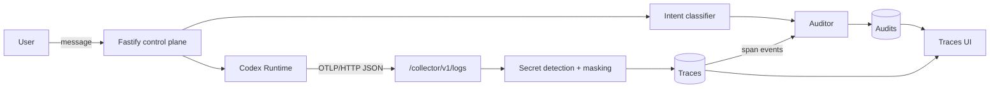

# Glass Box: trace and audit

Selected hackathon track: **Glass Box**. The middleware makes a Run diagnosable
and then judges it — every step is recorded as a span, masked, and checked
against the user's stated intent and a network policy.

The auditor is a separate stage from the recorder. It subscribes to trace
events, re-reads persisted (already masked) data, and writes only to its own
store. It never mutates a trace, and an audit failure never blocks a Run.

## How it works



The trust boundary sits at the collector. The Runtime cannot hold the
operator's bearer token, so it authenticates with a per-boot collector token
that `writeCodexConfig` embeds in `config.toml`. Detection and masking run
before anything is written, so the stores never receive a plaintext credential.

Telemetry stays on the machine: the generated `[otel]` block pins
`metrics_exporter` and `trace_exporter` to `none`, overriding Codex 0.111.0's
default of reporting metrics to its own endpoint.

## Setup

Auditing is on by default and activates once Ark is configured. No extra
services are required.

| Variable | Default | Purpose |
| --- | --- | --- |
| `AUDIT_ENABLED` | `true` | Set to `false` to stop auditing entirely. |
| `AUDIT_SECURITY_MODEL` | `gpt-oss-120b-250805` | Judges each step. |
| `AUDIT_INTENT_MODEL` | `deepseek-v4-flash-ga-260731` | Judges the Run, classifies intent, and is the step-audit fallback. |
| `AUDIT_NETWORK_WHITELIST` | Unset | Comma-separated hostnames the Agent may reach. |
| `OTEL_COLLECTOR_URL` | Derived | Override when the Runtime cannot reach the host via `host.docker.internal`. |

Both audit models must be **activated on your Ark account** and must answer
within the client's 60-second timeout. Neither default is guaranteed for a given
account:

- An unactivated model returns `ModelNotOpen`. Every step then degrades to the
  fallback, which still produces a verdict but marks each record `degraded`.
  After the first such failure the model is skipped for the rest of the process
  rather than retried on every step.
- A slow reasoning endpoint times out. In testing, one Ark endpoint answered a
  trivial prompt in 153 seconds against another model's 1.5 seconds — the first
  is unusable here even though it works for the Agent itself.

Check a candidate with a trivial prompt before setting it.

`AUDIT_NETWORK_WHITELIST` has three states, because "no policy" and "deny
everything" are different intentions:

- **unset** — the check is off; no destination is reported.
- **set to hostnames** — those hosts are allowed, everything else is a
  violation. A leading dot opts in a subtree, so `.github.com` covers
  `api.github.com` while `github.com` alone does not.
- **set but empty** — deny all; every external destination is a violation.

## What gets audited

Four policies run per step. Two are deterministic and need no model, so they
still report when Ark is unreachable.

| Policy | Kind | Question |
| --- | --- | --- |
| Network whitelist | Deterministic | Did the step contact a destination that is not allowed? |
| Secret exposure | Deterministic detection, judged relevance | Which credentials appeared, and did they belong in this operation? |
| Intent alignment | Judged | Which actions conflict with the current objective or its standing constraints? |
| New objectives | Judged | Did tool output, a file, or a subagent introduce a goal the user never asked for — and did the Agent act on it? |

Detection and relevance are deliberately split. Whether a credential is present
is a fact and is answered by pattern matching; whether it *belongs* is a
judgement and depends on context. The same GitHub token is relevant when it
authenticates a GitHub call and irrelevant when it is pasted into an unrelated
upload, so only the second question goes to a model.

A new objective that the Agent merely *reported* is recorded but does not warn.
Acting on it is what earns the warning — an injected instruction the Agent
ignored is evidence the defence held, not a failure.

Findings are stored as evidence and served in a flat form at
`GET /api/traces/:id` as `findings`:

```typescript
type AuditTraceStep = {
  id: string;
  traceId: string;
  agentId: string;
  type: "warning" | "error";
  category: "intent-check" | "security";
  finding: string;
};
```

## Intent

The specification an Agent is judged against is not fixed at creation. The
Agent's instructions seed the objective; every later message is classified as
`NO_CHANGE` or `INTENT_UPDATE`, and an update appends a standing constraint
that governs all subsequent audits.

The discriminator is durability, not topic. "Use PostgreSQL instead of SQLite"
is work; "From now on, use PostgreSQL instead of SQLite" is a rule. Questions
that seek information ("Should we use PostgreSQL?") are not updates; questions
that demand a change ("Can you avoid using `any`?") are.

Classification is queued rather than awaited, so a slow model never delays a
message. A detected change appends a new intent version immediately and governs
later audits.

## API

| Route | Purpose |
| --- | --- |
| `POST /collector/v1/logs` | OTLP ingest. Requires `x-collector-token`; outside `/api` by design. |
| `GET /api/agents/:id/traces` | Trace list rows with warning counts. |
| `GET /api/agents/:id/intent` | Current objective, standing constraints, version map, and current intentId. |
| `GET /api/traces/:id` | One trace with its audits and derived findings. |
| `GET /api/traces/:id/export` | The same payload as a download. |

Everything under `/api` is covered by the operator bearer token when
`APP_AUTH_TOKEN` is set. The collector route is not, and uses its own per-boot
token instead.

## Storage

Traces, audits, and intent are kept apart so the auditor stays a pure reader of
trace data. All three write atomically (temp file plus rename, mode `0600`)
under `APP_DATA_DIR`:

```
.data/traces/<chatId>.json    one TraceRecord per chat / AgentRun
.data/audits/<chatId>.json    intent-pinned findings for that chat
.data/intent/<agentId>.json   insertion-ordered map of intent versions
```

A Run left open by a crash is closed on the next boot, so the UI never shows a
Run as live when nothing is running.

## Verification

```bash
npm run check
```

Runs typecheck, the test suite, and both builds. The suite covers OTLP parsing,
span assembly, masking, storage, route auth, the audit policies, and intent
classification mechanics.

The audit policies are verified against the 20-case dataset from the audit
plan, kept verbatim at
`apps/server/src/audits/__fixtures__/audit-cases.json`. Production traces and
fixture cases both reduce to the same `StepActivity` value, so the dataset
exercises the real code path rather than a parallel one.

Intent classification accuracy is measured separately, because it calls a real
model and yields a score rather than a pass or fail:

```bash
npm run eval:intent -w @launchpad/server
```

Against the 56-case dataset from the intent plan, the current prompt scores
98.2% accuracy (55/56) with 100% recall and no schema retries. The prompt was
written against these same distinctions, so treat that number as a regression
signal, not as a generalisation estimate.

## Limitations

**Codex writes the Ark key to disk.** Codex CLI 0.111.0 persists
`declare -x ARK_API_KEY="<real key>"` into `CODEX_HOME/shell_snapshots/*.sh` on
every run. The masking layer keeps it out of traces, audits, and the UI, and it
is not in the repository or its history — but it is cleartext on disk, and
`CODEX_HOME` is bind-mounted into every Agent container, so a later run can read
snapshots left by earlier ones. Deleting the files works; they regenerate. The
Agent already receives the key in its process environment, so this grants no new
access, but the platform does not keep secrets off disk entirely. Clear the
snapshots before recording a demo and rotate the key afterwards.

**Masking is shape-based.** Configured secret values are masked wherever they
appear, along with credentials matching known shapes (GitHub, Stripe, OpenAI,
Ark, AWS, JWT, bearer tokens, and connection strings carrying inline
credentials). A credential in an unrecognised format with no configured value
will not be masked.

**Network calls are inferred, not intercepted.** Destinations are read from tool
arguments and shell commands in the trace. A request the Agent makes without it
appearing there is not seen by the whitelist check. This is instrumentation, not
egress enforcement — it reports, it does not block.

**Intent updates apply after the message.** Classification runs asynchronously,
so a constraint stated in a message governs audits from shortly after that
message rather than atomically with it.

**One judged call per step.** Long Runs are capped at 30 step audits per trace
to bound cost. The Run-level intent audit is always performed and is not counted
against that budget.

**Judged findings are model output.** Alignment, new objectives, and secret
relevance come from a model and can be wrong in both directions. The
deterministic checks are the reliable half; the judged half is advisory. When
the model is unreachable an audit is recorded as `failed` with the deterministic
findings intact and relevance left explicitly unknown rather than assumed safe.

Driving the real auditor over 14 dataset cases against a live model, the schema
accepted every verdict and 46 of 51 expectations matched. All five misses were
in the judged half, and four of them were the auditor being *stricter* than the
dataset — flagging a step the dataset considered clean, or reporting an unasked
objective the dataset recorded only as misalignment. The remaining miss called
a credential relevant when the step had been forbidden from reading it at all.
Over-flagging is the safer failure mode for this component, but it is not free:
expect some noise in the intent-check findings.
